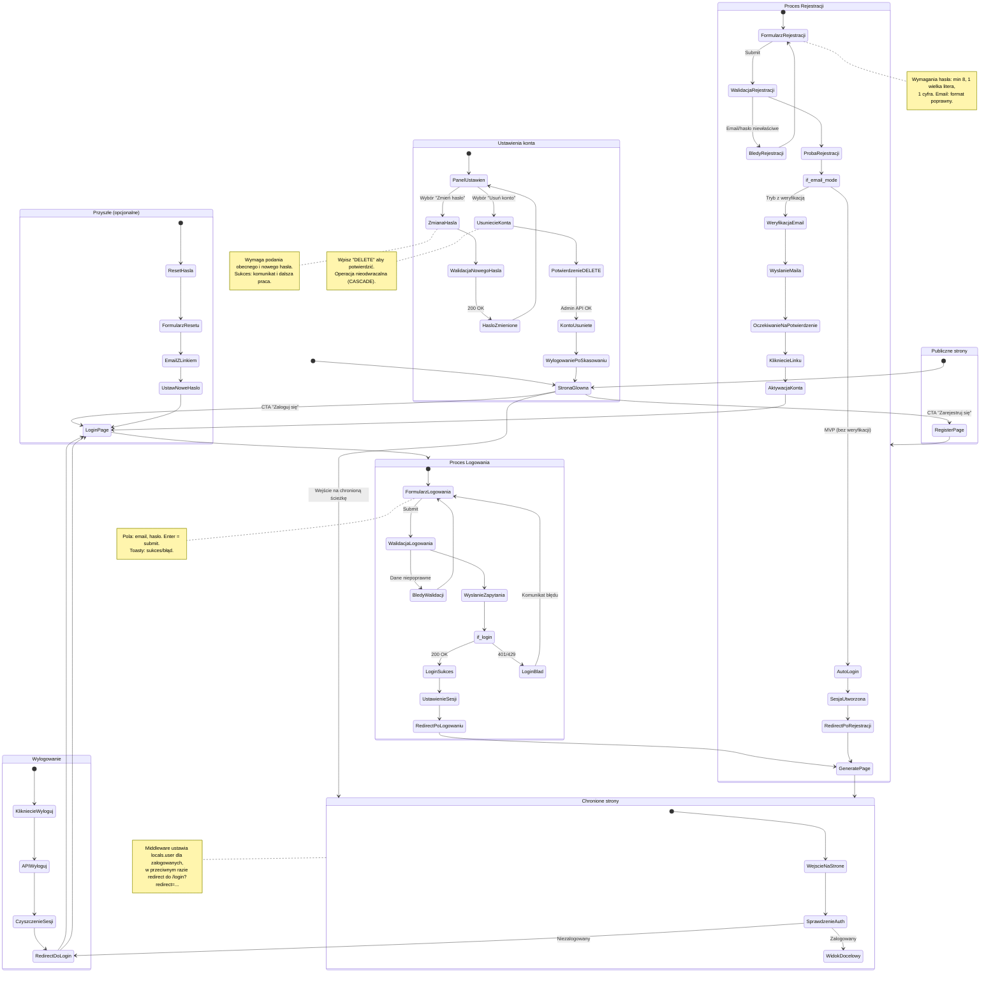

<user_journey_analysis>

- Ścieżki (PRD + spec): `/`, `/login`, `/register`, `/settings`,
  chronione: `/generate`, `/dashboard`, `/flashcards`, `/study`,
  `/generations`, `/generations/[id]`.
- Główne podróże:
  1) Dostęp do chronionych stron (middleware + redirect),
  2) Rejestracja (MVP: auto‑login; alt: weryfikacja e‑mail),
  3) Logowanie (JWT w HttpOnly cookies),
  4) Wylogowanie,
  5) Zmiana hasła (w `Settings`),
  6) Usunięcie konta (admin API + cascade + wylogowanie).
- Punkty decyzyjne:
  - `isAuthenticated?` (middleware),
  - Walidacja formularzy (email/hasło),
  - Wynik logowania (200/401/429),
  - Rejestracja: sukces/konflikt/słabe hasło; tryb weryfikacji e‑mail,
  - Potwierdzenie operacji usunięcia konta ("DELETE").
- Opisy stanów (skróty):
  - Strony publiczne: wejście do logowania/rejestracji.
  - Middleware: ustalenie `locals.user` lub redirect.
  - Logowanie/Rejestracja: walidacja → próba → sukces/odmowa.
  - Chronione strony: dostęp tylko po sesji.
  - Settings: zmiana hasła/usunięcie konta.

</user_journey_analysis>

<mermaid_diagram>

</mermaid_diagram>

